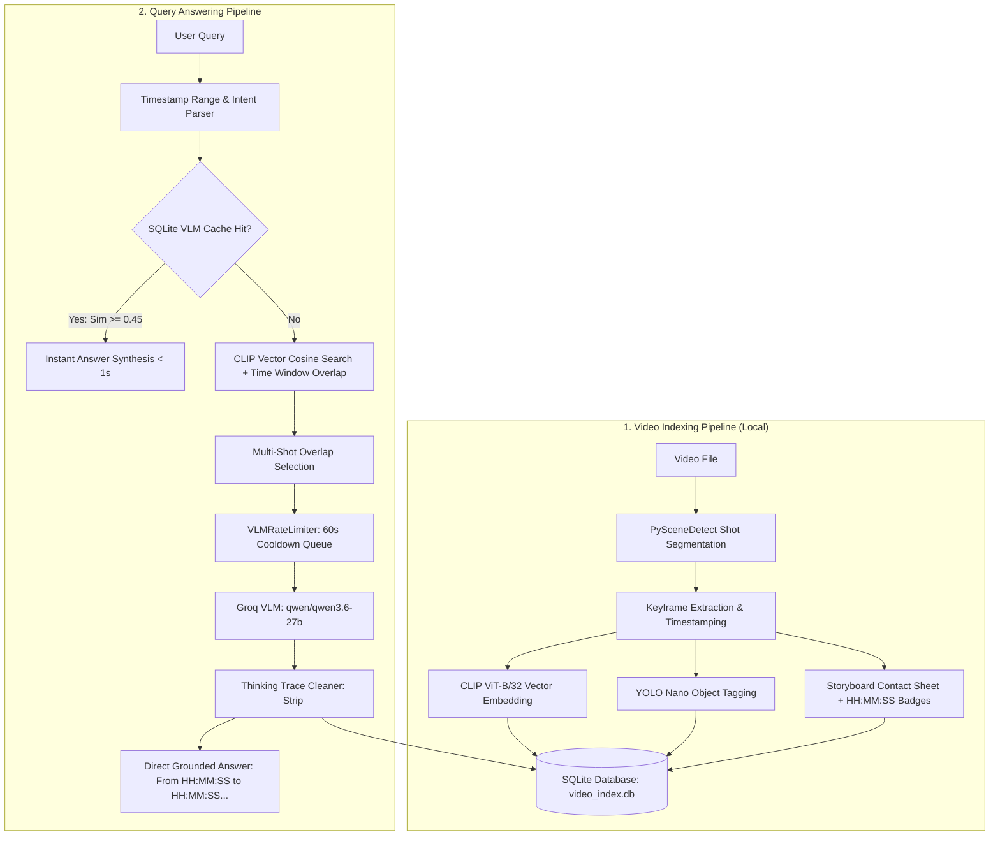

# Agentic Video Search & Analytics Engine

An enterprise-grade, agentic multimodal video analytics engine that performs local scene indexing, visual vector search, and rate-guarded visual reasoning using **Groq VLM (`qwen/qwen3.6-27b`)**, **CLIP (`openai/clip-vit-base-patch32`)**, and **SQLite**.

---

## 🏛️ System Architecture



---

## ⚙️ How Video Indexing Works

> **📌 Executive Summary**: 
> Video indexing converts raw MP4 files into a searchable local vector database entirely on your machine without cloud dependencies. It automatically splits video into visual scene shots (`PySceneDetect`), samples keyframe images, computes 512-dimensional visual vector embeddings (`CLIP`), extracts object tags (`YOLO`), and builds base64 storyboard contact sheets with burned-in `[HH:MM:SS]` timestamp badges stored inside SQLite (`video_index.db`).

---

### Step-by-Step Deep Dive:

#### 1. Scene Shot Detection & Keyframe Extraction (`src/video/processor.py`)
- **PySceneDetect Integration**: Segments raw video into coherent visual shots using content-aware thresholding (`ContentDetector(threshold=27.0)`).
- **Uniform Keyframe Sampling**: Extracts keyframes at 1-second intervals across every shot, recording exact Presentation Timestamps (`pts_seconds`) and formatted string timestamps (`HH:MM:SS`).

#### 2. Multimodal Vector Embedding & Tagging (`src/indexing/local_indexer.py` & `src/indexing/embeddings.py`)
- **CLIP Visual Vector Embeddings**: Passes keyframe images through `openai/clip-vit-base-patch32` to generate 512-dimensional normalized dense visual vectors.
- **YOLO Object Tagging**: Runs Ultralytics YOLO nano over keyframes to detect target objects (`person`, `car`, `motorcycle`, etc.) and store JSON tag arrays.

#### 3. Storyboard Contact Sheet Compositing (`src/video/processor.py`)
- Composites keyframes of each shot into a single timestamp-annotated contact sheet image grid.
- Burns visible `[HH:MM:SS]` timestamp badges into the corner of each keyframe tile and converts the final storyboard into a base64 JPEG payload.

#### 4. SQLite Vector Storage (`video_index.db`)
- Persists metadata into three relational tables:
  - `videos`: Total duration, shot count, file paths.
  - `shots`: Start/end seconds, start/end string timestamps, base64 storyboards, YOLO tags.
  - `keyframes`: Frame index, presentation timestamp, 512-dim CLIP binary vector blobs.

---

## 🔍 How the System Answers a Query

> **📌 Executive Summary**: 
> When a query is asked (e.g., *"what happened between 15 to 25 seconds"* or *"is there a person with a black jacket?"*), the system parses timestamp ranges, searches SQLite for previously cached visual observations for instant sub-second answers (< 1s), ranks candidate video shots using CLIP visual vector cosine similarity and time window overlap, submits at most 1 storyboard grid to Groq VLM (`qwen/qwen3.6-27b`) while respecting a 60-second rate-limit queue, strips LLM internal thinking traces (`<think>...</think>`), and synthesizes a direct answer citing exact timestamps.

---

### Step-by-Step Deep Dive:

#### 1. Intent & Timestamp Parsing
- **Timestamp Range Extractor**: `parse_query_timestamp_range` parses requested time windows in multiple formats:
  - String timestamps: `00:00:15 to 00:00:25` ➔ `(15.0s, 25.0s)`
  - Integer range: `15 to 25 seconds` ➔ `(15.0s, 25.0s)`
  - Decimal notation: `0.15 to 0.25 seconds` ➔ `(15.0s, 25.0s)` (scaled when video length > 10s).
- **Summary Intent Router**: Detects queries like *"summarize the video"* and routes to full-narrative aggregation.

#### 2. Tier 1: Fast Cache Search (Zero-API Retrieval)
- Embeds the user query using `SentenceTransformers (all-MiniLM-L6-v2)`.
- Performs cosine similarity against previously cached Groq VLM observations in SQLite (`vlm_observations`).
- If similarity is high ($\ge 0.45$), returns an instant grounded answer in **< 1 second** without making any VLM API calls.

#### 3. Tier 2: Multi-Shot Vector & Overlap Search
- Embeds query into CLIP text space (`embed_clip_text`).
- Calculates cosine similarity against keyframe visual vectors and checks YOLO tags.
- If a timestamp interval is specified (e.g. `15s to 25s`), computes exact time interval overlap against shot boundaries (`start_sec` to `end_sec`).
- Selects **all candidate shots** overlapping the target interval (e.g., Shot #3 `15s-20s` **and** Shot #4 `20s-25s`).

#### 4. Rate-Guarded Groq VLM Execution (`src/vlm/rate_limiter.py` & `src/vlm/client.py`)
- **Strict 60s Cooldown Queue**: `VLMRateLimiter` guarantees at least 60 seconds between API calls to strictly respect Groq rate limits.
- **Max 1 New VLM Call Per Query**: Router caps un-analyzed storyboard VLM calls to at most 1 per query, combining newly analyzed facts with existing cached observations.
- **4096 Completion Tokens**: Sets `max_completion_tokens=4096` to prevent truncation during DeepSeek/Qwen thinking traces.

#### 5. Thinking Trace Removal & Grounded Answer Synthesis
- `clean_thinking_trace` uses regex pattern matching to remove internal LLM thinking blocks (`<think>...</think>`, `Here's a thinking process:...`, `Draft:`, `Final Polish:`).
- Synthesizes a clean, direct timestamped answer formatted as:
  > **From [HH:MM:SS] to [HH:MM:SS], [grounded visual actions]...**

---

## 🚀 Quick Start

### 1. Prerequisites
- Python 3.10+ (tested on Python 3.14)
- Groq API Key (Set in `.env`)

### 2. Installation
```bash
# Clone the repository
git clone <repository_url>
cd agentic_vdo_search

# Create virtual environment and install dependencies
python3 -m venv .venv
source .venv/bin/activate
pip install -r requirements.txt
```

### 3. Environment Configuration
Create a `.env` file in the root directory:
```env
GROQ_API_KEY=your_groq_api_key_here
GROQ_VLM_MODEL=qwen/qwen3.6-27b
```

### 4. Running the Web Application
```bash
streamlit run app.py
```
Open [http://localhost:8501](http://localhost:8501) in your browser.

---

## 📁 Repository Structure

```
agentic_vdo_search/
├── app.py                     # Streamlit Web User Interface
├── src/
│   ├── config.py              # Environment & App Settings
│   ├── video/
│   │   └── processor.py       # PySceneDetect Shot Detection & Storyboard Compositor
│   ├── indexing/
│   │   ├── embeddings.py      # CLIP Visual Vector & SentenceTransformer Engines
│   │   └── local_indexer.py   # SQLite Ingestion, Vector Search & Timestamp Parser
│   ├── vlm/
│   │   ├── client.py          # Groq VLM SDK Client & Thinking Cleaner
│   │   ├── rate_limiter.py    # 60-Second Cooldown Queue Rate Limiter
│   │   └── cache.py           # SQLite VLM Observation Store & Filtering
│   └── agent/
│       └── router.py          # Hybrid Two-Tier Router & Multi-Shot Aggregator
├── tests/                     # Unit Test Suite (8 passing tests)
├── video_index.db             # Local SQLite Storage Database
└── requirements.txt           # Python Package Dependencies
```
